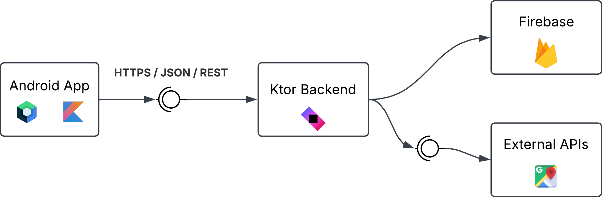
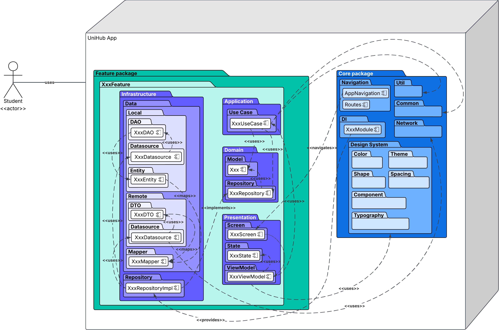

# UniHub — Architecture

## 1. Architectural Overview

UniHub is an Android mobile application designed to centralize the academic organization of university students. The application combines academic management, scheduling, location-aware events, academic calculations, notifications, and AI-assisted interaction.

The project follows **Clean Architecture** with feature-based modular organization. Each major application capability is isolated under `features/`, while cross-cutting concerns are placed under `core/`.

The architecture is designed for:

- Maintainability and separation of concerns.
- Testability of business rules without Android or external-service dependencies.
- Clear boundaries between business logic and infrastructure.
- Offline-first local interaction where appropriate.
- Cloud synchronization through Firebase.
- Controlled backend operations through Ktor.
- Secure authentication and authorization.
- Reactive UI using Jetpack Compose and Kotlin coroutines.
- Incremental development by a single developer with extensive AI assistance.

## 2. Architectural Style

### 2.1 Clean Architecture

UniHub uses four logical layers inside each feature:

```text
Presentation
     ↓
Application
     ↓
Domain
     ↑
Infrastructure
```

The dependency direction is controlled so that the **Domain layer remains independent of frameworks and external technologies**.

The layers are:

| Layer            | Responsibility                                                                         | Main technologies                            |
|------------------|----------------------------------------------------------------------------------------|----------------------------------------------|
| `domain`         | Business entities, value objects, repository contracts and core rules                  | Pure Kotlin                                  |
| `application`    | Application-specific use cases and orchestration                                       | Kotlin, Coroutines                           |
| `infrastructure` | Concrete implementations for local storage, remote services, Firebase and repositories | Room, Firebase, Ktor Client, Google services |
| `presentation`   | UI, state and state holders                                                            | Jetpack Compose, ViewModel                   |

### 2.2 Feature-Based Organization

Clean Architecture is applied **inside each feature**, rather than creating one global `domain`, `data` or `repository` package for the entire application.

This allows each feature to own its business logic and infrastructure while keeping dependencies explicit.

Examples:

```text
features/
├── academic/
├── ai/
├── auth/
├── calendar/
├── dashboard/
├── geolocation/
├── notifications/
└── settings/
```

A feature may contain only the layers it actually needs. For example, a simple presentation-only feature does not need to create unnecessary repositories or data sources.

## 3. Architectural Patterns

UniHub applies the following patterns and architectural practices.

| Pattern / Practice        | Application in UniHub                                                                                   |
|---------------------------|---------------------------------------------------------------------------------------------------------|
| **MVVM**                  | ViewModels expose UI state and receive UI events without containing composable layout logic.            |
| **Repository Pattern**    | Domain repository interfaces abstract data access from concrete Firebase, Room and API implementations. |
| **Use Case Pattern**      | Application actions are represented by focused use cases with a single responsibility.                  |
| **Dependency Injection**  | Dependencies are provided through centralized DI modules and injected into consumers.                   |
| **Reactive State**        | Compose observes immutable UI state and reacts to state changes.                                        |
| **Mapper Pattern**        | DTOs, local entities and domain models are explicitly mapped instead of being reused across layers.     |
| **Single Responsibility** | Classes and components have focused responsibilities.                                                   |
| **Dependency Inversion**  | Domain and application layers depend on abstractions rather than infrastructure implementations.        |

## 4. System Architecture

### 4.1 Technology Boundaries

The main system boundaries are:

```text
┌──────────────────────────────────────────────────────────────┐
│                         Android App                          │
│                                                              │
│  Jetpack Compose                                             │
│  MVVM + Clean Architecture                                   │
│  Kotlin + Coroutines                                         │
│                                                              │
│  Presentation → Application → Domain ← Infrastructure        │
│                                      │                       │
│                         Room / Firebase / APIs               │
└───────────────────────────────┬──────────────────────────────┘
                                │
                     HTTPS / JSON / REST
                                │
                                ▼
┌──────────────────────────────────────────────────────────────┐
│                         Ktor Backend                         │
│                                                              │
│  Kotlin + Ktor                                               │
│  REST API                                                    │
│  Authentication / authorization validation                   │
│  Server-side operations                                      │
│  External-service integration where required                 │
└───────────────┬───────────────────────┬──────────────────────┘
                │                       │
                ▼                       ▼
       Firebase Services          External APIs
       Authentication            Google Maps / related
       Firestore
       Cloud Messaging
       AI services where applicable
```

### 4.2 System Context Diagram

The system context diagram represents UniHub as a system and shows its main external actors and services.



### 4.3 Architecture Diagram

The architecture diagram must identify the technologies used by each major part of the system:

- **Frontend:** Android application.
- **UI:** Jetpack Compose.
- **Application language:** Kotlin.
- **Backend language:** Kotlin.
- **Backend framework:** Ktor.
- **Application protocol:** HTTPS.
- **API format:** JSON.
- **Cloud services:** Firebase.
- **Authentication:** Firebase Authentication with Google OAuth.
- **Cloud persistence:** Cloud Firestore.
- **Local persistence:** Room / SQLite.
- **Maps and location:** Google Maps Platform and Android location APIs.
- **Push notifications:** Firebase Cloud Messaging.
- **AI:** Gemini through the selected Google/Firebase AI integration.
- **Containerization:** Docker for the Ktor backend.
- **CI/CD:** GitHub Actions.

The diagram should distinguish between local application processing, backend processing and third-party/cloud services.

## 5. Backend Architecture

The Ktor backend is not intended to reproduce the entire Android application architecture.

Its purpose is to provide a controlled server-side boundary for operations that benefit from backend validation, centralized business rules, external integrations or future expansion.

### 5.1 Ktor Responsibilities

The backend may handle:

- REST API endpoints.
- Authentication token validation.
- Authorization checks.
- Request validation.
- DTO serialization and deserialization.
- Server-side business operations that should not be trusted to the client.
- Integration with selected external services.
- Centralized error handling.
- Logging.
- Health checks.

The Android application communicates with Ktor through:

```text
Android App
    │
    │ HTTPS
    │ JSON
    ▼
Ktor REST API
    │
    ├── Authentication / Authorization
    ├── Validation
    ├── Application services
    └── External integrations
```

### 5.2 Backend Technology Stack

| Concern          | Technology                                      |
|------------------|-------------------------------------------------|
| Language         | Kotlin                                          |
| Framework        | Ktor                                            |
| Protocol         | HTTPS                                           |
| API style        | REST                                            |
| Serialization    | Kotlin Serialization                            |
| Authentication   | Firebase-issued tokens / server-side validation |
| Containerization | Docker                                          |
| CI               | GitHub Actions                                  |

## 6. Firebase Architecture

Firebase provides managed cloud services required by the application.

### 6.1 Firebase Authentication

Firebase Authentication manages user authentication.

Google authentication is the primary OAuth provider planned for the MVP.

```text
User
 ↓
Google OAuth
 ↓
Firebase Authentication
 ↓
Authenticated Firebase User
 ↓
Application session
```

The application must not store user passwords directly.

### 6.2 Cloud Firestore

Firestore is used for cloud synchronization of application data that must persist across devices or sessions.

Examples include:

- User profile.
- Subjects.
- Tasks.
- Events.
- Academic records.
- Preferences.
- Relevant AI interaction data when persistence is explicitly required.

The exact Firestore collections and document relationships are defined in:

**[Database Documentation](../database/DATABASE.md)**

### 6.3 Firebase Cloud Messaging

FCM is responsible for push notifications where remote notification delivery is required.

Local reminders may be scheduled on the device when server connectivity is unnecessary.

## 7. Local Persistence

UniHub uses local persistence to provide responsive interaction and reduce unnecessary network dependency.

The planned local persistence technology is **Room**, backed by SQLite.

The infrastructure layer owns:

```text
Room Database
├── Entities
├── DAO
└── Local data source
```

The application does not expose Room entities to the Domain or Presentation layers.

The transformation is:

```text
Room Entity
     ↓
Mapper
     ↓
Domain Model
```

This prevents infrastructure-specific representations from leaking into business logic.

## 8. Package and Component Architecture

The Android source tree follows feature-based Clean Architecture.

### 8.1 Root Package

```text
com.unihub.app/
├── core/
└── features/
```

`core` contains cross-cutting components shared by multiple features.

`features` contains business capabilities and their internal Clean Architecture layers.

### 8.2 Core Package

```text
com.unihub.app/
└── core/
    ├── designsystem/
    │   ├── color/
    │   ├── component/
    │   ├── shape/
    │   ├── spacing/
    │   ├── theme/
    │   └── typography/
    │
    ├── di/
    ├── navigation/
    ├── network/
    ├── util/
    └── common/
```

Typical responsibilities:

| Package        | Responsibility                                          |
|----------------|---------------------------------------------------------|
| `designsystem` | Shared Compose visual system and reusable UI components |
| `di`           | Dependency injection modules                            |
| `navigation`   | Navigation routes and navigation infrastructure         |
| `network`      | Shared HTTP/API configuration                           |
| `util`         | Generic extensions and utility functions                |
| `common`       | Cross-feature shared abstractions when justified        |

The `core` package must not become a general-purpose dumping ground. Functionality should only be placed here when it is genuinely shared or cross-cutting.

### 8.3 Feature Structure

Each feature follows the same architectural structure where applicable:

```text
features/
└── academic/
    ├── application/
    │   └── usecase/
    │
    ├── domain/
    │   ├── model/
    │   └── repository/
    │
    ├── infrastructure/
    │   ├── data/
    │   │   ├── local/
    │   │   └── remote/
    │   └── repository/
    │
    └── presentation/
        ├── screen/
        │   └── components/
        ├── state/
        └── viewmodel/
```

The same organization is applied to other features as required:

```text
features/
├── academic/
├── ai/
├── auth/
├── calendar/
├── dashboard/
├── geolocation/
├── notifications/
└── settings/
```

### 8.4 Domain Package

Example:

```text
academic/
└── domain/
    ├── model/
    │   ├── Subject.kt
    │   ├── Task.kt
    │   ├── Event.kt
    │   ├── Grade.kt
    │   └── AcademicPeriod.kt
    │
    └── repository/
        ├── SubjectRepository.kt
        ├── TaskRepository.kt
        ├── EventRepository.kt
        └── GradeRepository.kt
```

Domain models represent application concepts.

Examples:

```text
Subject
Task
Event
Grade
AcademicPeriod
```

Repository interfaces define contracts such as:

```text
SubjectRepository
TaskRepository
EventRepository
GradeRepository
```

The Domain layer must not import:

- Android framework classes.
- Compose.
- Room.
- Firebase SDKs.
- Ktor.
- Retrofit.
- Google Maps SDK.
- Concrete repository implementations.

### 8.5 Application Package

Example:

```text
academic/
└── application/
    └── usecase/
        ├── CreateSubjectUseCase.kt
        ├── UpdateSubjectUseCase.kt
        ├── CreateTaskUseCase.kt
        ├── CompleteTaskUseCase.kt
        ├── CreateEventUseCase.kt
        ├── CalculateWeightedAverageUseCase.kt
        └── CalculateRequiredGradeUseCase.kt
```

Use cases coordinate application actions.

A use case should represent a meaningful operation rather than becoming a generic utility class.

### 8.6 Infrastructure Package

Example:

```text
academic/
└── infrastructure/
    ├── data/
    │   ├── local/
    │   │   ├── dao/
    │   │   │   ├── SubjectDao.kt
    │   │   │   └── TaskDao.kt
    │   │   ├── datasource/
    │   │   │   └── AcademicDatabase.kt
    │   │   └── entity/
    │   │
    │   └── remote/
    │       ├── dto/
    │   │   ├── datasource/
    │       └── AcademicApi.kt
    │
    └── repository/
        ├── SubjectRepositoryImpl.kt
        ├── TaskRepositoryImpl.kt
        ├── EventRepositoryImpl.kt
        └── GradeRepositoryImpl.kt
```

Infrastructure contains implementations of the contracts defined by Domain.

It is the layer allowed to know about:

- Room.
- Firebase.
- Ktor Client.
- HTTP.
- Serialization.
- Android location services.
- Google Maps.
- Other external SDKs.

### 8.7 Presentation Package

Example:

```text
academic/
└── presentation/
    ├── screen/
    │   └── AcademicScreen.kt
    │
    ├── state/
    │   ├── AcademicUiState.kt
    │   └── AcademicEvent.kt
    │
    └── viewmodel/
        └── AcademicViewModel.kt
```

Presentation is responsible for:

- Rendering Compose UI.
- Collecting reactive state.
- Translating UI interactions into events.
- Invoking application use cases through ViewModels.
- Representing loading, success, empty and error states.

Presentation must not directly access Room, Firebase or network clients.

## 9. Package and Component Diagram

The package/component diagram combines the Android package hierarchy with important components and their relationships.



The diagram should represent at least:

```text
com.unihub.app
│
├── core
│   ├── designsystem
│   ├── navigation
│   ├── di
│   └── network
│
└── features
    │
    ├── auth
    │   ├── presentation
    │   ├── application
    │   ├── domain
    │   └── infrastructure
    │
    ├── academic
    │   ├── presentation
    │   ├── application
    │   ├── domain
    │   └── infrastructure
    │
    ├── calendar
    ├── dashboard
    ├── geolocation
    ├── ai
    ├── notifications
    └── settings
```

Important component relationships include:

```text
Screen
  ↓
ViewModel
  ↓
UseCase
  ↓
Repository interface
  ↓
Repository implementation
  ↓
Data Source
  ↓
Room / Firebase / Ktor API
```

The diagram must distinguish **interfaces/contracts** from **concrete implementations**.

## 10. Data Flow

A standard read/write flow follows this structure:

```text
┌──────────────┐
│ Compose UI   │
└──────┬───────┘
       │ UI Event
       ▼
┌──────────────┐
│  ViewModel   │
└──────┬───────┘
       │
       ▼
┌──────────────┐
│   Use Case   │
└──────┬───────┘
       │
       ▼
┌────────────────────┐
│ Repository Contract│
└─────────┬──────────┘
          │
          ▼
┌──────────────────────┐
│ Repository Impl      │
└─────────┬────────────┘
          │
       ┌──┴─────────────┐
       ▼                ▼
┌────────────┐   ┌─────────────┐
│ Local Data │   │ Remote Data │
│ Room       │   │ Firebase /  │
│            │   │ Ktor API    │
└────────────┘   └─────────────┘
```

The reverse direction transforms infrastructure data into Domain models and then into Presentation state.

## 11. Reactive State

UniHub uses reactive state to keep the UI synchronized with application data.

The general pattern is:

```text
Data Source
    ↓
Repository
    ↓
Use Case
    ↓
ViewModel
    ↓
StateFlow / immutable UI state
    ↓
Jetpack Compose
```

ViewModels should expose immutable state to the UI.

UI events should be represented explicitly rather than allowing composables to manipulate application data directly.

Example:

```text
AcademicScreen
      │
      ├── onAddSubject()
      ├── onDeleteSubject()
      └── onCalculateAverage()
               │
               ▼
       AcademicViewModel
               │
               ▼
          Use Cases
```

## 12. Coroutines and Concurrency

Kotlin Coroutines are used for asynchronous operations.

Potential coroutine-based operations include:

- Room queries.
- Firestore operations.
- HTTP requests.
- AI requests.
- Location operations.
- Synchronization.
- Notification-related background work.

The architecture must avoid blocking the main thread.

ViewModels may launch application operations within an appropriate lifecycle-aware coroutine scope.

Infrastructure implementations should expose suspend functions or reactive streams when appropriate.

## 13. Dependency Injection

Dependency Injection is used to provide implementations to application components without tightly coupling them to concrete classes.

The dependency direction follows:

```text
Presentation
    ↓
Application
    ↓
Domain abstractions
    ↑
Infrastructure implementations
```

DI modules are centralized under:

```text
core/di/
```

Examples of injected dependencies include:

- Repository implementations.
- Use cases.
- Room database.
- DAOs.
- Firebase clients.
- Ktor HTTP client.
- API services.
- Location services.
- AI services.

## 14. Mapping Strategy

UniHub separates representations between layers.

Typical transformations are:

```text
Remote DTO
    ↓
DTO Mapper
    ↓
Domain Model
```

and:

```text
Room Entity
    ↓
Entity Mapper
    ↓
Domain Model
```

When persistence is required:

```text
Domain Model
    ↓
Entity Mapper
    ↓
Room Entity
```

The same principle applies to API requests and responses.

This prevents external schemas from becoming part of the business model.

## 15. Security Architecture

Security is treated as a cross-cutting concern.

The planned security boundaries include:

```text
Google OAuth
     ↓
Firebase Authentication
     ↓
Authenticated User
     ↓
Firebase authorization rules / token
     ↓
Ktor token validation when backend access is required
     ↓
Authorized operation
```

Sensitive application data must not be exposed through logs or unsecured local storage.

Security-specific decisions are documented separately in:

**[Security Documentation](../security/SECURITY.md)**

## 16. Geolocation Architecture

Geolocation is intentionally limited to the application's academic scheduling use case.

The application uses location for events such as:

- University classes.
- Meetings.
- Academic activities.
- Other scheduled events with a physical location.

An event may be:

```text
Physical
    ├── Address
    ├── Coordinates
    └── Map representation

Remote
    └── Meeting URL
```

The application does not use location for unnecessary arrival detection or continuous location tracking.

Google Maps and Android location APIs belong to the infrastructure boundary.

## 17. AI Architecture

AI is exposed to the user through a lightweight assistant capable of accepting text or voice input.

Examples:

```text
"Add a Calculus class tomorrow from 6 to 8 AM at UdeA."

"Add a task for Software Engineering due Friday."

"I have these three assignments. How should I organize today?"
```

The AI layer should not directly modify application state.

Instead:

```text
User Input
    ↓
AI Feature
    ↓
Intent / Structured Result
    ↓
Validation
    ↓
Use Case
    ↓
Repository
    ↓
Application State
```

This keeps AI as an interface/orchestration mechanism rather than a source of business truth.

AI-specific implementation details are documented as the feature evolves.

## 18. Navigation Architecture

Navigation is centralized through the navigation infrastructure.

Feature screens should not directly depend on one another's internal implementation details.

Conceptually:

```text
App Navigation
│
├── Auth
│
└── Main
    ├── Dashboard
    ├── Calendar
    ├── Academic
    ├── AI Assistant
    └── Settings
```

Navigation destinations should be represented using typed or structured route definitions where supported by the selected Navigation Compose version.

## 19. Error Handling

Errors are handled at the appropriate architectural boundary.

Typical categories include:

- Validation errors.
- Authentication errors.
- Authorization errors.
- Network failures.
- Firebase failures.
- Database failures.
- AI failures.
- Location permission errors.
- Unexpected application errors.

Infrastructure-specific exceptions should not leak directly into Presentation.

Instead:

```text
Infrastructure Exception
        ↓
Repository / Mapper
        ↓
Domain/Application error
        ↓
ViewModel
        ↓
UI error state
```

The UI must provide appropriate loading, empty, success and error states.

## 20. Offline and Synchronization Strategy

UniHub prioritizes local responsiveness.

Where appropriate:

```text
UI
 ↓
Local persistence
 ↓
Immediate UI update
 ↓
Cloud synchronization
```

Cloud synchronization must handle:

- Temporary network loss.
- Retryable failures.
- Authentication expiration.
- Conflicting updates where relevant.
- Synchronization state.

The exact synchronization rules will be documented in `DATABASE.md` as the persistence model is finalized.

## 21. Testing Architecture

Testing follows the architectural boundaries.

### Domain

Test:

- Business rules.
- Calculations.
- Validation.
- Use-case behavior.

### Application

Test:

- Use-case orchestration.
- Repository interaction.
- Success and failure paths.

### Infrastructure

Test:

- Repository implementations.
- Mappers.
- Local data access.
- Remote data handling.

### Presentation

Test:

- ViewModel state transitions.
- UI behavior.
- Important Compose user flows.

The testing strategy will prioritize business-critical functionality such as:

- Weighted average calculation.
- Required-grade simulation.
- Task management.
- Event management.
- Authentication flows.
- AI command interpretation.
- Synchronization behavior.

## 22. SOLID Principles

The architecture follows SOLID principles.

### Single Responsibility

Each class should have one primary reason to change.

### Open/Closed

New implementations should be added through abstractions where practical rather than modifying stable business logic.

### Liskov Substitution

Repository implementations must satisfy the behavior expected by their domain contracts.

### Interface Segregation

Interfaces should remain focused and avoid forcing consumers to depend on unused methods.

### Dependency Inversion

High-level business logic depends on abstractions rather than infrastructure implementations.

## 23. Architecture Constraints

The following rules are mandatory unless an architectural decision explicitly changes them.

1. Domain must remain framework-independent.
2. Presentation must not access infrastructure data sources directly.
3. ViewModels must not contain persistence implementation details.
4. Composables must not directly call Firebase, Room or HTTP clients.
5. Repository interfaces belong to `domain/repository/`.
6. Repository implementations belong to `infrastructure/repository/`.
7. Use cases belong to `application/usecase/`.
8. DTOs and Room entities must not be exposed as Domain models.
9. Mappers must be used at architectural boundaries.
10. Shared functionality belongs in `core/` only when it is genuinely cross-cutting.
11. Feature-specific code must remain inside its feature.
12. Infrastructure dependencies must not leak into Domain.
13. Long-running or blocking work must not execute on the main thread.
14. Secrets and credentials must not be committed to Git.
15. Sensitive information must not be written to application logs.

## 24. Architecture Evolution

This document describes the initial architecture for the project.

Architecture decisions may change as implementation progresses, particularly after:

- Initial prototyping.
- Firebase integration.
- Ktor integration.
- AI integration.
- Performance testing.
- Security review.
- User testing.

Significant architectural changes must be documented as decisions and reflected in the corresponding diagrams.

The current architecture should remain intentionally simple enough to be implemented and maintained by a single developer within the academic project timeframe.

## 25. Related Documentation

| Document                                        | Purpose                                    |
|-------------------------------------------------|--------------------------------------------|
| [Specification](../../SPEC.md)                  | Product scope and specification            |
| [Planning](../PLANNING.md)                      | Development plan and milestones            |
| [Requirements](../requirements/REQUIREMENTS.md) | Functional and non-functional requirements |
| [Database](../database/DATABASE.md)             | Data model and persistence architecture    |
| [API](../api/API.md)                            | Ktor API contract                          |
| [Security](../security/SECURITY.md)             | Security model and controls                |
| [Design System](../design/DESIGNSYSTEM.md)      | UI visual system and reusable components   |
| [User Journey](../design/USERJOURNEY.md)        | Main user journeys and interaction flows   |

## 26. Initial Architecture Diagram

The following conceptual diagram summarizes the intended architecture:

```diagram
diagram UniHubArchitecture

    actor Student

    component "Android App\nKotlin + Jetpack Compose" as Android

    package "com.unihub.app" {
        package "core" {
            component "Design System" as DesignSystem
            component "Navigation" as Navigation
            component "DI" as DI
        }

        package "features" {
            package "academic" {
                component "Presentation" as AcademicPresentation
                component "Application / Use Cases" as AcademicApplication
                component "Domain" as AcademicDomain
                component "Infrastructure" as AcademicInfrastructure
            }

            package "auth" {
                component "Auth Presentation" as AuthPresentation
                component "Auth Application" as AuthApplication
                component "Auth Domain" as AuthDomain
                component "Auth Infrastructure" as AuthInfrastructure
            }

            package "calendar" {
                component "Calendar Feature" as Calendar
            }

            package "ai" {
                component "AI Assistant" as AI
            }

            package "geolocation" {
                component "Location & Maps" as Location
            }
        }
    }

    component "Ktor REST API\nKotlin + Ktor" as Ktor
    database "Room / SQLite" as Room
    database "Cloud Firestore" as Firestore
    component "Firebase Authentication" as FirebaseAuth
    component "Firebase Cloud Messaging" as FCM
    component "Google Maps Platform" as Maps
    component "Gemini / AI Service" as Gemini

    Student --> Android

    Android --> AcademicPresentation
    Android --> AuthPresentation
    Android --> Calendar
    Android --> AI
    Android --> Location

    AcademicPresentation --> AcademicApplication
    AcademicApplication --> AcademicDomain
    AcademicDomain --> AcademicInfrastructure
    AcademicInfrastructure --> Room
    AcademicInfrastructure --> Firestore
    AcademicInfrastructure --> Ktor

    AuthPresentation --> AuthApplication
    AuthApplication --> AuthDomain
    AuthDomain --> AuthInfrastructure
    AuthInfrastructure --> FirebaseAuth

    Calendar --> Room
    Calendar --> Firestore

    AI --> Gemini
    AI --> Ktor

    Location --> Maps
    Android --> FCM

end
```

This conceptual diagram is complemented by the final visual diagrams stored in `docs/architecture/`.
