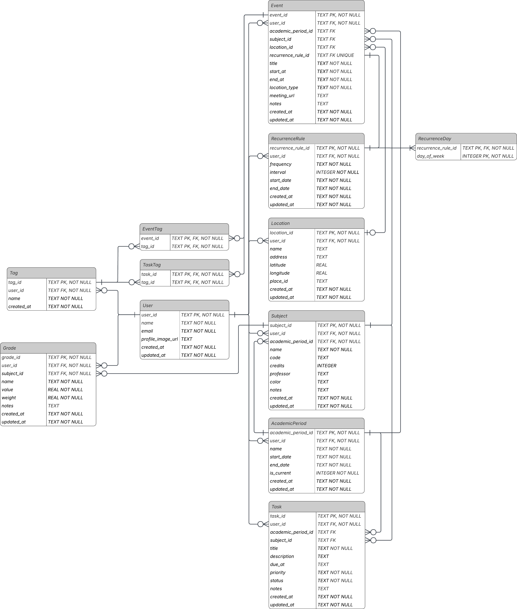

# UniHub — Database

## 1. Document Information

| Field          | Value                     |
|----------------|---------------------------|
| Project        | UniHub                    |
| Document       | Database                  |
| Version        | 0.2                       |
| Status         | Initial Design            |
| Persistence    | Room + Firebase Firestore |
| Local database | SQLite through Room       |
| Cloud database | Cloud Firestore           |

## 2. Purpose

This document defines the relational data model and persistence strategy for UniHub.

The relational model is designed for Room and describes the entities, attributes, keys, constraints, cardinalities, and referential relationships required by the current product scope.

The Firestore model represents the same application data as user-owned documents and is intentionally not a literal copy of the relational schema.

The model includes academic periods, subjects, events, recurring event rules, locations, tasks, grades, and tags.

## 3. Persistence Strategy

| Storage                 | Role                                       | Data model               |
|-------------------------|--------------------------------------------|--------------------------|
| Room                    | Local persistence and offline-first access | Relational               |
| Firebase Firestore      | Cloud persistence and synchronization      | Document-oriented        |
| Firebase Authentication | Authentication and identity                | Managed identity service |

The authenticated Firebase UID is used as the stable application `User.user_id`.

Room entities are persistence representations. Domain models must not be exposed directly from the infrastructure layer to the presentation layer.

## 4. Relational Model

### 4.1 Design Conventions

Relational entities use singular PascalCase names.

```text
User
AcademicPeriod
Subject
Event
RecurrenceRule
RecurrenceDay
Location
Task
Grade
Tag
EventTag
TaskTag
```

The following conventions apply:

- Primary keys use `TEXT` identifiers.
- Foreign keys use the same `TEXT` type as their referenced primary key.
- Required attributes are `NOT NULL`.
- Optional attributes are nullable.
- Date and date-time values use ISO-8601-compatible `TEXT` representations.
- Time-only values use `TEXT` in `HH:mm` format.
- Boolean values use Room-supported Boolean mapping.
- Enumerated states use controlled string values or Kotlin enums converted by Room.
- Many-to-many relationships use associative entities.
- Recurrence days are normalized into a separate entity instead of storing multiple weekdays in one column.
- Domain models are mapped to and from Room entities through mappers.

### 4.2 `User`

| Column              | Type | Constraints  | Description                                         |
|---------------------|------|--------------|-----------------------------------------------------|
| `user_id`           | TEXT | PK, NOT NULL | Firebase UID and stable application user identifier |
| `name`              | TEXT | NOT NULL     | User display name                                   |
| `email`             | TEXT | NOT NULL     | User email                                          |
| `profile_image_url` | TEXT | NULL         | Profile image URL                                   |
| `created_at`        | TEXT | NOT NULL     | Creation timestamp                                  |
| `updated_at`        | TEXT | NOT NULL     | Last update timestamp                               |

**Relationships**

- `User` 1 — 0..N `AcademicPeriod`
- `User` 1 — 0..N `Subject`
- `User` 1 — 0..N `Event`
- `User` 1 — 0..N `RecurrenceRule`
- `User` 1 — 0..N `Location`
- `User` 1 — 0..N `Task`
- `User` 1 — 0..N `Grade`
- `User` 1 — 0..N `Tag`

### 4.3 `AcademicPeriod`

Represents an academic period, normally a university semester.

| Column               | Type    | Constraints  | Description                                        |
|----------------------|---------|--------------|----------------------------------------------------|
| `academic_period_id` | TEXT    | PK, NOT NULL | Unique period identifier                           |
| `user_id`            | TEXT    | FK, NOT NULL | Owner                                              |
| `name`               | TEXT    | NOT NULL     | Period name, such as `2026-2`                      |
| `start_date`         | TEXT    | NOT NULL     | Period start date                                  |
| `end_date`           | TEXT    | NOT NULL     | Period end date                                    |
| `is_current`         | INTEGER | NOT NULL     | Whether this is the user's current academic period |
| `created_at`         | TEXT    | NOT NULL     | Creation timestamp                                 |
| `updated_at`         | TEXT    | NOT NULL     | Last update timestamp                              |

**Relationships**

- `User` 1 — 0..N `AcademicPeriod`
- `AcademicPeriod` 1 — 0..N `Subject`
- `AcademicPeriod` 1 — 0..N `Event`
- `AcademicPeriod` 1 — 0..N `Task`

Previous academic periods are preserved when a new period becomes current.

### 4.4 `Subject`

| Column               | Type    | Constraints  | Description                    |
|----------------------|---------|--------------|--------------------------------|
| `subject_id`         | TEXT    | PK, NOT NULL | Unique subject identifier      |
| `user_id`            | TEXT    | FK, NOT NULL | Owner                          |
| `academic_period_id` | TEXT    | FK, NOT NULL | Academic period                |
| `name`               | TEXT    | NOT NULL     | Subject name                   |
| `code`               | TEXT    | NULL         | University subject code        |
| `credits`            | INTEGER | NULL         | Academic credits               |
| `professor`          | TEXT    | NULL         | Professor name                 |
| `color`              | TEXT    | NULL         | User/interface color reference |
| `notes`              | TEXT    | NULL         | Additional notes               |
| `created_at`         | TEXT    | NOT NULL     | Creation timestamp             |
| `updated_at`         | TEXT    | NOT NULL     | Last update timestamp          |

**Relationships**

- `User` 1 — 0..N `Subject`
- `AcademicPeriod` 1 — 0..N `Subject`
- `Subject` 1 — 0..N `Event`
- `Subject` 1 — 0..N `Task`
- `Subject` 1 — 0..N `Grade`

### 4.5 `Location`

| Column        | Type | Constraints  | Description                              |
|---------------|------|--------------|------------------------------------------|
| `location_id` | TEXT | PK, NOT NULL | Unique location identifier               |
| `user_id`     | TEXT | FK, NOT NULL | Owner                                    |
| `name`        | TEXT | NULL         | User-facing location name                |
| `address`     | TEXT | NULL         | Human-readable address                   |
| `latitude`    | REAL | NULL         | Geographic latitude                      |
| `longitude`   | REAL | NULL         | Geographic longitude                     |
| `place_id`    | TEXT | NULL         | External place identifier when available |
| `created_at`  | TEXT | NOT NULL     | Creation timestamp                       |
| `updated_at`  | TEXT | NOT NULL     | Last update timestamp                    |

**Relationships**

- `User` 1 — 0..N `Location`
- `Location` 0..1 — 0..N `Event`

The same physical location can be reused by multiple events.

### 4.6 `Event`

Represents an individual calendar event or the event definition from which recurring occurrences are calculated.

| Column               | Type | Constraints      | Description                                         |
|----------------------|------|------------------|-----------------------------------------------------|
| `event_id`           | TEXT | PK, NOT NULL     | Unique event identifier                             |
| `user_id`            | TEXT | FK, NOT NULL     | Owner                                               |
| `academic_period_id` | TEXT | FK, NULL         | Optional academic period                            |
| `subject_id`         | TEXT | FK, NULL         | Optional subject                                    |
| `location_id`        | TEXT | FK, NULL         | Optional physical location                          |
| `recurrence_rule_id` | TEXT | FK, NULL, UNIQUE | Optional recurrence rule                            |
| `title`              | TEXT | NOT NULL         | Event name                                          |
| `start_at`           | TEXT | NOT NULL         | Start date and time of the first or only occurrence |
| `end_at`             | TEXT | NOT NULL         | End date and time of the first or only occurrence   |
| `location_type`      | TEXT | NOT NULL         | `PHYSICAL`, `REMOTE`, or `NONE`                     |
| `meeting_url`        | TEXT | NULL             | Remote meeting URL                                  |
| `notes`              | TEXT | NULL             | Additional notes                                    |
| `created_at`         | TEXT | NOT NULL         | Creation timestamp                                  |
| `updated_at`         | TEXT | NOT NULL         | Last update timestamp                               |

**Relationships**

- `User` 1 — 0..N `Event`
- `AcademicPeriod` 0..1 — 0..N `Event`
- `Subject` 0..1 — 0..N `Event`
- `Location` 0..1 — 0..N `Event`
- `RecurrenceRule` 0..1 — 0..1 `Event`

An event may be personal or academic and may have no subject, academic period, or physical location.

A physical event uses `location_id`.

A remote event may use `meeting_url` instead of `location_id`.

For a recurring event, subsequent occurrences are calculated from the associated `RecurrenceRule`.

### 4.7 `RecurrenceRule`

Represents the recurrence configuration of an event.

| Column               | Type    | Constraints  | Description                                   |
|----------------------|---------|--------------|-----------------------------------------------|
| `recurrence_rule_id` | TEXT    | PK, NOT NULL | Unique recurrence rule identifier             |
| `user_id`            | TEXT    | FK, NOT NULL | Owner                                         |
| `frequency`          | TEXT    | NOT NULL     | `DAILY` or `WEEKLY`                           |
| `interval`           | INTEGER | NOT NULL     | Number of frequency units between repetitions |
| `start_date`         | TEXT    | NOT NULL     | First date included in the recurrence         |
| `end_date`           | TEXT    | NOT NULL     | Last date included in the recurrence          |
| `created_at`         | TEXT    | NOT NULL     | Creation timestamp                            |
| `updated_at`         | TEXT    | NOT NULL     | Last update timestamp                         |

Supported recurrence UI:

```text
Does not repeat
Every day
Every week
Custom
```

`Every week` and `Custom` use `WEEKLY`. `Custom` additionally defines selected weekdays through `RecurrenceDay`.

**Relationships**

- `User` 1 — 0..N `RecurrenceRule`
- `RecurrenceRule` 1 — 1 `Event`
- `RecurrenceRule` 1 — 1..N `RecurrenceDay`

The rule does not duplicate the event title, subject, location, notes, or time.

### 4.8 `RecurrenceDay`

Represents one weekday selected by a weekly recurrence rule.

| Column               | Type    | Constraints      | Description                    |
|----------------------|---------|------------------|--------------------------------|
| `recurrence_rule_id` | TEXT    | PK, FK, NOT NULL | Recurrence rule                |
| `day_of_week`        | INTEGER | PK, NOT NULL     | ISO weekday number from 1 to 7 |

```text
1 = Monday
2 = Tuesday
3 = Wednesday
4 = Thursday
5 = Friday
6 = Saturday
7 = Sunday
```

**Relationships**

- `RecurrenceRule` 1 — 1..N `RecurrenceDay`

The composite primary key `(recurrence_rule_id, day_of_week)` prevents duplicate weekdays.

Daily recurrence does not require weekday rows.

### 4.9 Recurring Event Example

The user input:

```text
Create Event

Title
Computación Móvil

Subject
Computación Móvil

When
Aug 3, 2026

Time
4:00 PM → 6:00 PM

Repeat
Custom

Repeat every
Week

On
Tuesday
Thursday
Saturday

From
Aug 3, 2026

Until
Dec 6, 2026

Location
UdeA — Bloque XX

Notes
...
```

is represented by one event definition and one recurrence rule:

```text
Event
    title = "Computación Móvil"
    start_at = "2026-08-04T16:00:00-05:00"
    end_at = "2026-08-04T18:00:00-05:00"
    subject_id = ...
    location_id = ...
    recurrence_rule_id = ...

RecurrenceRule
    frequency = "WEEKLY"
    interval = 1
    start_date = "2026-08-03"
    end_date = "2026-12-06"

RecurrenceDay
    Tuesday
    Thursday
    Saturday
```

The application calculates occurrences such as:

```text
Tue 04/08 16:00–18:00
Thu 06/08 16:00–18:00
Sat 08/08 16:00–18:00
...
```

The recurrence pattern is stored once rather than creating one database row for every occurrence.

If different weekdays require different times, they are represented by separate event definitions and recurrence rules.

### 4.10 `Task`

| Column               | Type | Constraints  | Description                              |
|----------------------|------|--------------|------------------------------------------|
| `task_id`            | TEXT | PK, NOT NULL | Unique task identifier                   |
| `user_id`            | TEXT | FK, NOT NULL | Owner                                    |
| `academic_period_id` | TEXT | FK, NULL     | Optional academic period                 |
| `subject_id`         | TEXT | FK, NULL     | Optional subject                         |
| `title`              | TEXT | NOT NULL     | Task title                               |
| `description`        | TEXT | NULL         | Task description                         |
| `due_at`             | TEXT | NULL         | Deadline                                 |
| `priority`           | TEXT | NOT NULL     | `LOW`, `MEDIUM`, or `HIGH`               |
| `status`             | TEXT | NOT NULL     | `PENDING`, `IN_PROGRESS`, or `COMPLETED` |
| `notes`              | TEXT | NULL         | Additional notes                         |
| `created_at`         | TEXT | NOT NULL     | Creation timestamp                       |
| `updated_at`         | TEXT | NOT NULL     | Last update timestamp                    |

**Relationships**

- `User` 1 — 0..N `Task`
- `AcademicPeriod` 0..1 — 0..N `Task`
- `Subject` 0..1 — 0..N `Task`

### 4.11 `Grade`

| Column       | Type | Constraints  | Description                 |
|--------------|------|--------------|-----------------------------|
| `grade_id`   | TEXT | PK, NOT NULL | Unique grade identifier     |
| `user_id`    | TEXT | FK, NOT NULL | Owner                       |
| `subject_id` | TEXT | FK, NOT NULL | Subject receiving the grade |
| `name`       | TEXT | NOT NULL     | Evaluation name             |
| `value`      | REAL | NOT NULL     | Grade value                 |
| `weight`     | REAL | NOT NULL     | Evaluation weight           |
| `notes`      | TEXT | NULL         | Additional notes            |
| `created_at` | TEXT | NOT NULL     | Creation timestamp          |
| `updated_at` | TEXT | NOT NULL     | Last update timestamp       |

**Relationships**

- `User` 1 — 0..N `Grade`
- `Subject` 1 — 0..N `Grade`

### 4.12 `Tag`

| Column       | Type | Constraints  | Description           |
|--------------|------|--------------|-----------------------|
| `tag_id`     | TEXT | PK, NOT NULL | Unique tag identifier |
| `user_id`    | TEXT | FK, NOT NULL | Owner                 |
| `name`       | TEXT | NOT NULL     | Tag name              |
| `created_at` | TEXT | NOT NULL     | Creation timestamp    |

**Relationships**

- `User` 1 — 0..N `Tag`
- `Event` 0..N — 0..N `Tag` through `EventTag`
- `Task` 0..N — 0..N `Tag` through `TaskTag`

### 4.13 `EventTag`

| Column     | Type | Constraints      | Description      |
|------------|------|------------------|------------------|
| `event_id` | TEXT | PK, FK, NOT NULL | Event identifier |
| `tag_id`   | TEXT | PK, FK, NOT NULL | Tag identifier   |

The composite primary key `(event_id, tag_id)` prevents duplicate tag assignments.

### 4.14 `TaskTag`

| Column    | Type | Constraints      | Description     |
|-----------|------|------------------|-----------------|
| `task_id` | TEXT | PK, FK, NOT NULL | Task identifier |
| `tag_id`  | TEXT | PK, FK, NOT NULL | Tag identifier  |

The composite primary key `(task_id, tag_id)` prevents duplicate tag assignments.

## 5. Relational Relationships Summary

| Relationship                       | Cardinality | Foreign key                        |
|------------------------------------|------------:|------------------------------------|
| `User` → `AcademicPeriod`          |    1 : 0..N | `AcademicPeriod.user_id`           |
| `User` → `Subject`                 |    1 : 0..N | `Subject.user_id`                  |
| `AcademicPeriod` → `Subject`       |    1 : 0..N | `Subject.academic_period_id`       |
| `User` → `Event`                   |    1 : 0..N | `Event.user_id`                    |
| `AcademicPeriod` → `Event`         | 0..1 : 0..N | `Event.academic_period_id`         |
| `Subject` → `Event`                | 0..1 : 0..N | `Event.subject_id`                 |
| `Location` → `Event`               | 0..1 : 0..N | `Event.location_id`                |
| `User` → `RecurrenceRule`          |    1 : 0..N | `RecurrenceRule.user_id`           |
| `RecurrenceRule` → `Event`         |       1 : 1 | `Event.recurrence_rule_id`         |
| `RecurrenceRule` → `RecurrenceDay` |    1 : 1..N | `RecurrenceDay.recurrence_rule_id` |
| `User` → `Location`                |    1 : 0..N | `Location.user_id`                 |
| `User` → `Task`                    |    1 : 0..N | `Task.user_id`                     |
| `AcademicPeriod` → `Task`          | 0..1 : 0..N | `Task.academic_period_id`          |
| `Subject` → `Task`                 | 0..1 : 0..N | `Task.subject_id`                  |
| `User` → `Grade`                   |    1 : 0..N | `Grade.user_id`                    |
| `Subject` → `Grade`                |    1 : 0..N | `Grade.subject_id`                 |
| `User` → `Tag`                     |    1 : 0..N | `Tag.user_id`                      |
| `Event` → `EventTag`               |    1 : 0..N | `EventTag.event_id`                |
| `Tag` → `EventTag`                 |    1 : 0..N | `EventTag.tag_id`                  |
| `Task` → `TaskTag`                 |    1 : 0..N | `TaskTag.task_id`                  |
| `Tag` → `TaskTag`                  |    1 : 0..N | `TaskTag.tag_id`                   |

## 6. Referential Integrity

| Parent           | Child               | Recommended behavior           |
|------------------|---------------------|--------------------------------|
| `User`           | User-owned entities | Controlled account cleanup     |
| `AcademicPeriod` | `Subject`           | RESTRICT / controlled deletion |
| `AcademicPeriod` | `Event`             | SET NULL                       |
| `AcademicPeriod` | `Task`              | SET NULL                       |
| `Subject`        | `Event`             | SET NULL                       |
| `Subject`        | `Task`              | SET NULL                       |
| `Subject`        | `Grade`             | RESTRICT / controlled deletion |
| `Location`       | `Event`             | SET NULL                       |
| `RecurrenceRule` | `Event`             | CASCADE                        |
| `RecurrenceRule` | `RecurrenceDay`     | CASCADE                        |
| `Event`          | `EventTag`          | CASCADE                        |
| `Task`           | `TaskTag`           | CASCADE                        |
| `Tag`            | `EventTag`          | CASCADE                        |
| `Tag`            | `TaskTag`           | CASCADE                        |

Deleting an academic period must not delete historical grades or unrelated personal information.

## 7. Room Implementation

Feature-specific Room entities and DAOs belong inside the corresponding feature's infrastructure layer.

```text
com.unihub.app/
└── features/
    └── xFeature/
        └── infrastructure/
            └── data/
                └── local/
                    ├── dao/
                    │   └── XxxDao.kt
                    ├── datasource/
                    │   └── XxxDataSource.kt
                    └── entity/
                        └── XxxEntity.kt
```

Persistence mapping:

```text
Room Entity
    ↓
Mapper
    ↓
Domain Model
    ↓
Use Case
    ↓
ViewModel
    ↓
Compose UI
```

For writes:

```text
Compose UI
    ↓
ViewModel
    ↓
Use Case
    ↓
Repository
    ↓
Mapper
    ↓
Room Entity
    ↓
DAO
```

Recurring occurrences are calculated by application logic from the `Event`, `RecurrenceRule`, `RecurrenceDay` records, and requested calendar date range.

## 8. Firestore Document Model

Firestore is document-oriented and does not reproduce the Room schema literally.

```text
users/
    {userId}/
        profile/
            ...

        academicPeriods/
            {academicPeriodId}/
                ...

        subjects/
            {subjectId}/
                ...

        events/
            {eventId}/
                ...

        recurrenceRules/
            {recurrenceRuleId}/
                days/
                    {dayId}/
                        ...

        locations/
            {locationId}/
                ...

        tasks/
            {taskId}/
                ...

        grades/
            {gradeId}/
                ...

        tags/
            {tagId}/
                ...
```

A recurring event stores its recurrence definition once. The calendar calculates occurrences for the requested date range.

Firestore may denormalize selected read-optimized fields where necessary, provided synchronization rules remain explicit.

## 9. Date and Time Representation

SQLite does not provide a dedicated native `DATE` or `DATETIME` storage class. UniHub therefore uses `TEXT` with standardized ISO-8601-compatible representations.

Date:

```text
2026-08-03
```

Time:

```text
16:00
```

Date and time:

```text
2026-08-03T16:00:00-05:00
```

This supports both multi-hour and multi-day events.

The application uses appropriate Kotlin date/time types and Room converters at the infrastructure boundary.

## 10. Data Validation Rules

The application must validate data before persistence.

Examples:

- Event title must not be empty.
- Event end must not precede event start.
- A physical event should contain sufficient location data.
- A remote event should contain a valid meeting URL when required.
- A recurring event must have a valid recurrence rule.
- `RecurrenceRule.end_date` must not precede `start_date`.
- A weekly recurrence must contain at least one `RecurrenceDay`.
- `RecurrenceDay.day_of_week` must be between 1 and 7.
- `RecurrenceRule.interval` must be greater than zero.
- Subject, academic period, and location references must belong to the same user as the event.
- Grade values and weights must comply with the configured academic grading rules.
- Required subject names must not be empty.

## 11. Indexing Considerations

Room indexes should be added according to demonstrated query patterns.

Candidates include:

- `Subject(user_id, academic_period_id)`
- `Event(user_id, start_at)`
- `Event(user_id, subject_id)`
- `Event(user_id, recurrence_rule_id)`
- `RecurrenceRule(user_id, start_date, end_date)`
- `RecurrenceDay(recurrence_rule_id, day_of_week)`
- `Task(user_id, due_at)`
- `Task(user_id, status)`
- `Task(user_id, subject_id)`
- `Grade(user_id, subject_id)`

Firestore indexes will be created according to the queries required by the application.

## 12. MER

The current relational model is represented in:



The image should be stored at:

```text
docs/database/mer.png
```

The MER must reflect the relational model defined in this document, including primary keys, foreign keys, optional attributes, data types, cardinalities, associative entities, recurrence entities, and referential relationships.

## 13. Database Evolution

Changes to the data model must be reflected in:

1. Room entities and migrations.
2. Firestore document model.
3. Repository implementations.
4. Mappers.
5. Relevant requirements.
6. The MER.
7. This document.

Room schema changes must use proper migrations once the application contains persisted user data.

Firestore schema changes must consider existing documents and backward compatibility where necessary.

## 14. Design Decisions

### 14.1 Recurrence is modeled separately

Recurring events are not represented by storing multiple weekdays in one column.

```text
Event
   │
   └── 0..1 RecurrenceRule
                │
                └── 1..N RecurrenceDay
```

This preserves normalization and supports daily, weekly, and custom weekly repetition.

### 14.2 Recurring occurrences are calculated

The database stores the recurrence definition rather than one row per occurrence.

This avoids unnecessary duplication and allows the calendar to generate only the occurrences required for the visible date range.

### 14.3 Different times require different event definitions

A recurrence rule represents one time interval.

Therefore:

```text
Tuesday    16:00–18:00
Thursday   16:00–18:00
Saturday   14:00–16:00
```

is represented by three event definitions when the times differ.

### 14.4 Events remain independent from subjects

An event may be:

- Academic and associated with a subject.
- Academic without a specific subject.
- Personal and unrelated to an academic period.
- Physical.
- Remote.
- Without a location.

This allows UniHub to function as a student's general planning application while preserving academic context where it exists.
